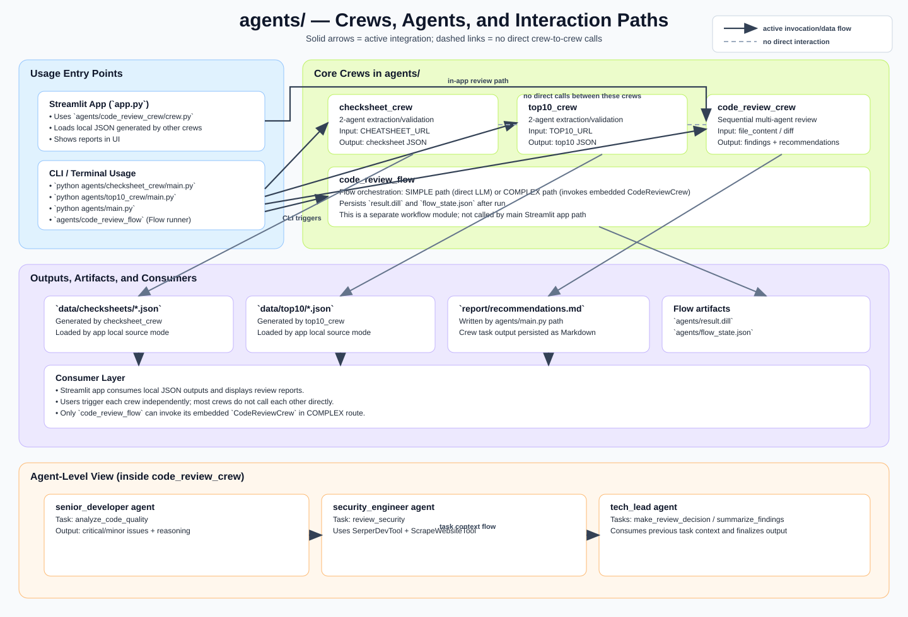

# OWASP Security Workbench — 1-Hour Presentation Guide

Audience: Mixed (technical + non-technical)  
Duration: 60 minutes max  
Format: Live presentation + guided demo

---

## 0) Session Goal (what attendees should leave with)

By the end of this session, attendees should understand:
- What the application does and why it exists
- Which technologies power it
- How each major module contributes to the workflow
- How to run and use the main functionality (including review workflows)

---

## 1) Agenda (60 minutes)

- 0:00–0:05 — Opening and context
- 0:05–0:12 — What the application does, purpose, and value
- 0:12–0:20 — Technology stack and architecture overview
- 0:20–0:43 — Module-by-module walkthrough
- 0:43–0:56 — Live demo of functionality
- 0:56–1:00 — Wrap-up + Q&A

---

## 2) Opening Script (0:00–0:05)

Suggested talking points:
- “Today I’ll show an OWASP Security Workbench built with Streamlit and CrewAI.”
- “It centralizes security guidance exploration and AI-assisted code review.”
- “We’ll cover business purpose, architecture, modules, and then run a live demo.”

Slide content:
- Project name
- One-sentence mission
- Agenda

---

## 3) Introduction: What it does, purpose, and technologies (0:05–0:20)

### 3.1 What the application does (0:05–0:09)

Core capabilities:
- Browse OWASP Cheat Sheets (live or local JSON)
- Explore OWASP Top 10 sources (static/web/local)
- Run AI-assisted code reviews against selected OWASP context
- Generate downloadable Markdown reports

Simple value statement:
- “This reduces friction between security knowledge and secure coding decisions.”

### 3.2 Purpose and target users (0:09–0:12)

Purpose:
- Make OWASP guidance easier to access and operationalize
- Support faster, more consistent pre-review security checks

Primary users:
- Developers and tech leads
- AppSec/security engineers
- Teams running secure SDLC workshops

### 3.3 Technologies used (0:12–0:20)

Presentation-friendly stack summary:
- UI: Streamlit
- Data/modeling: Pydantic, pandas, PyYAML
- Parsing: BeautifulSoup + lxml
- HTTP/reliability: httpx + tenacity
- Scraping source: Firecrawl API
- AI orchestration: CrewAI + tools
- Storage: local JSON files + disk cache

Reference visual:
- Architecture diagram in README using `docs/images/architecture.svg`

Agents/Crews interaction visual:



---

## 4) Module-by-Module Explanation (0:20–0:43)

Use this section as your core walkthrough. Keep each module to ~2–4 minutes.

### 4.1 UI and Orchestration Entry Point (`app.py`) (0:20–0:24)

Explain:
- Single Streamlit entry point for all user flows
- Two main sections: Cheat Sheets and Top 10
- Shared code review panel and report viewer

Demo cue:
- Show sidebar navigation and page switching

### 4.2 Configuration Layer (`config.yaml`, `src/config_manager.py`) (0:24–0:27)

Explain:
- Environment + YAML config loading
- API keys, cache behavior, logging, rate limits
- Why this matters: portability and safer operations

Key message:
- “Config drives behavior without code changes.”

### 4.3 Data Acquisition (`src/firecrawl_client.py`) (0:27–0:30)

Explain:
- Firecrawl integration for live content scraping
- Retries and rate limiting
- Graceful failure handling

Key message:
- “External content is fetched reliably and respectfully.”

### 4.4 Parsing and Domain Modeling (`src/cheatsheet_parser.py`, `src/models.py`) (0:30–0:34)

Explain:
- Raw content is transformed into structured models
- Risks, sections, mitigations, examples, metadata
- Consistent schema powers both UI rendering and local data interchange

Key message:
- “Structure enables automation and consistency.”

### 4.5 Caching Layer (`src/cache_manager.py`) (0:34–0:36)

Explain:
- Disk cache with TTL and size limits
- Faster user experience and lower API usage

Key message:
- “Cache is critical for performance and stability.”

### 4.6 Top 10 Data Handling (`owasp_llm/config.yaml`, `src/top10_data.py`) (0:36–0:38)

Explain:
- Multiple source options (static/web/local)
- Static LLM Top 10 fallback and local JSON support

Key message:
- “Flexible sources support demos, workshops, and constrained environments.”

### 4.7 AI Workflows (`agents/*`) (0:38–0:43)

Explain quickly by function:
- `agents/checksheet_crew`: generate checksheet JSON from URL
- `agents/top10_crew`: generate Top 10 JSON from URL
- `agents/code_review_crew`: multi-agent review pipeline
- `agents/code_review_flow`: advanced flow routing SIMPLE vs COMPLEX

Key message:
- “Crews operationalize security guidance into practical outputs.”

---

## 5) Live Demo Script (0:43–0:56)

Goal: show end-to-end value without risking time overruns.

### Demo prep checklist (before session)

- Virtual env active and dependencies installed
- `.env` set with needed keys (`FIRECRAWL_API_KEY`, optionally `OPENAI_API_KEY`, `SERPER_API_KEY`)
- App starts successfully with:

```bash
streamlit run app.py
```

- One known cheat sheet URL ready
- One sample diff ready (can use existing sample files)

### Demo flow

#### Step 1 — Open app and orient audience (2 min)
- Show Cheat Sheets vs Top 10 sections
- Explain page navigation and data source options

#### Step 2 — Cheat Sheets exploration (3 min)
- Select `Live OWASP (Firecrawl)`
- Open a cheat sheet
- Show Overview + Risk Details + Matrix

#### Step 3 — Top 10 exploration (2 min)
- Switch to Top 10 section
- Show risks list and resources

#### Step 4 — Run code review panel (4 min)
- Upload file(s) or paste PR diff
- Add optional prompt context
- Execute review and show generated report

#### Step 5 — Show report lifecycle (2 min)
- Go to Reports page
- Open and download generated Markdown report

### Optional extension (if time remains)

Show local dataset generation commands:

```powershell
$env:CHEATSHEET_URL="https://cheatsheetseries.owasp.org/cheatsheets/Authentication_Cheat_Sheet.html"
python agents/checksheet_crew/main.py

$env:TOP10_URL="https://owasp.org/Top10/2025/"
python agents/top10_crew/main.py
```

Then switch app data source to local JSON and load generated files.

---

## 6) Speaker Notes for Mixed Audience

Use this language strategy:
- Business framing first, technical details second
- Avoid deep implementation details unless asked
- Translate technical value to outcomes (speed, consistency, traceability)

Examples:
- Instead of “Pydantic schemas,” say “structured, validated data format.”
- Instead of “tenacity retries,” say “automatic resilience for unstable calls.”

---

## 7) Common Questions + Suggested Answers

### Q1: Is this replacing human code review?
A: No. It is decision support and triage acceleration, not a replacement for human judgment.

### Q2: What if external services fail?
A: The app supports caching and local JSON workflows to continue operating.

### Q3: Is this OWASP-authoritative output?
A: OWASP remains the authoritative source; this app helps operationalize and navigate that guidance.

### Q4: Can we customize it for our policy?
A: Yes—through config, parser logic, and Crew task/agent definitions.

---

## 8) Timing Guardrails (to stay within 1 hour)

If running late:
- Skip deep code internals of parser/cache
- Run only one full demo path (Cheat Sheet + Code Review)
- Move local generation commands to Q&A

If running early:
- Show architecture SVG and map one user action end-to-end
- Show one Crew config file (`agents/*/config/*.yaml`) to explain extensibility

---

## 9) Closing Script (0:56–1:00)

Suggested close:
- “We saw how the workbench connects OWASP knowledge with practical review workflows.”
- “The key value is faster, more consistent security-aware development decisions.”
- “Next steps can be pilot integration in one repo/team and collect feedback.”

Call to action:
- Choose a pilot team and run this flow for one sprint.

---

## 10) Quick Links for Presenter

- Main documentation: `README.md`
- Spanish documentation: `README.es.md`
- Architecture diagram: `docs/images/architecture.svg`
- Main app: `app.py`
- Core modules: `src/`
- AI workflows: `agents/`
