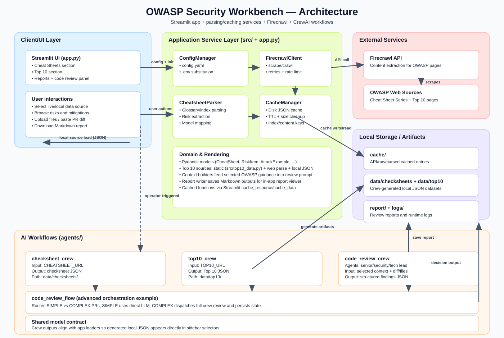

# OWASP Security Workbench (Streamlit + CrewAI)

Workspace unificado para exploración de seguridad y review de código para:

- Navegar **OWASP Cheat Sheets** (live scrape + structured parsing + cache)
- Explorar datasets **OWASP Top 10** (LLM Top 10 static + OWASP Top 10 2025 web/local)
- Ejecutar **AI-assisted code reviews** contra guidance OWASP seleccionado
- Generar y cargar **local JSON artifacts** mediante workflows de CrewAI

Este repositorio combina una aplicación Streamlit orientada a usuario con múltiples workflows de automatización basados en CrewAI para extracción y review de contenido.

---

## 1) Qué hace esta aplicación

La app principal (`app.py`) ofrece dos secciones operativas:

1. **Cheat Sheets**
   - Obtiene el índice de OWASP cheat sheets desde `Glossary.html`
   - Permite abrir cheat sheets individuales con vistas ricas (overview, risks, matrix, resources)
   - Soporta checksheet JSON local generado por `agents/checksheet_crew`

2. **Top 10**
   - Soporta múltiples data sources desde `owasp_llm/config.yaml`
   - Usa el dataset estático integrado de LLM risks para `llm_top10_2025`
   - Puede hacer scrape/parse de contenido OWASP Top 10 web para `owasp_top10_2025`
   - Soporta Top 10 JSON local generado por `agents/top10_crew`

Ambas secciones incluyen un **Code Review panel** compartido que puede ejecutar un workflow de review con CrewAI sobre archivos cargados o diffs pegados, generando reportes Markdown en `report/`.

---

## 2) Capacidades principales

- **Live content acquisition** vía Firecrawl API
- **Schema-based parsing** a modelos Pydantic (`src/models.py`)
- **Disk cache** con expiry + límites de tamaño (`src/cache_manager.py`)
- **Top 10 y Cheat Sheet context packaging** para code review guiado
- **CrewAI orchestration** para:
  - generación de check sheet JSON
  - generación de top 10 JSON
  - review de code quality/security y recomendaciones
- **Report lifecycle**: generar, visualizar y descargar reportes desde la app

---

## 3) Technology stack

### Runtime / framework
- Python 3.10+
- Streamlit

### Data & parsing
- BeautifulSoup4 + lxml
- Pydantic v2
- PyYAML
- pandas

### External integration
- Firecrawl Web Data API (scrape/crawl)
- Configuración basada en environment variables (`python-dotenv`)

### Reliability / utilities
- `httpx` para HTTP
- `tenacity` para retries
- Local JSON file caching (custom cache manager)

### AI workflows
- CrewAI (`crewai[tools]`)
- CrewAI tools como `ScrapeWebsiteTool` y `SerperDevTool`

---

## 4) Arquitectura



### Capas principales de la app

1. **UI Layer (`app.py`)**
   - Navegación basada en sidebar y selección de source
   - Renderers por sección: Overview, All Risks, Risk Details, Attack Examples, Risk Matrix, Resources, Reports

2. **Service Layer (`src/`)**
   - `config_manager.py`: YAML + env substitution (`${VAR}`)
   - `firecrawl_client.py`: scrape/crawl client, retries, throttling
   - `cheatsheet_parser.py`: glossary/index/page parsing a modelo estructurado
   - `cache_manager.py`: entradas de disk cache con TTL + metadata + size cleanup

3. **Model Layer (`src/models.py`)**
   - `CheatSheet`, `RiskItem`, `AttackExample`, `CheatSheetIndex`, etc.

4. **Data Layer**
   - Dataset estático LLM Top 10 (`src/top10_data.py`)
   - JSON local generado (`data/checksheets`, `data/top10`)
   - Runtime cache (`cache/`) y reportes (`report/`)

### CrewAI workflows

- `agents/checksheet_crew`: transforma una cheat sheet URL en checksheet JSON compatible con la app
- `agents/top10_crew`: transforma una Top 10 URL en Top 10 JSON compatible con la app
- `agents/code_review_crew`: multi-agent code review (quality + security + summary)
- `agents/code_review_flow`: ejemplo de flow-based orchestration con routing simple vs complex diffs

---

## 5) Mapa del repositorio (rutas importantes)

- `app.py` — aplicación Streamlit unificada
- `config.yaml` — config principal de la app (firecrawl/cache/logging/rate-limit)
- `src/` — parser, cache, client, config, models, static data
- `owasp_llm/config.yaml` — opciones de Top 10 data source para el sidebar
- `agents/` — workflows y configs de CrewAI
- `report/` — reportes Markdown de review generados
- `cache/` — almacén JSON de cache + metadata

---

## 6) Prerrequisitos

- Python 3.10+
- Acceso de red a páginas OWASP y endpoints de Firecrawl API
- Firecrawl API key para operaciones live scrape

Recomendado (para tareas de review/extracción con CrewAI):

- `OPENAI_API_KEY`
- `SERPER_API_KEY` (usado por el search tool del agente de seguridad)

---

## 7) Instalación

Desde la raíz del repositorio:

```bash
python -m venv .venv
```

Activar virtual environment:

- Windows PowerShell:

```powershell
.\.venv\Scripts\Activate.ps1
```

- macOS/Linux:

```bash
source .venv/bin/activate
```

Instalar dependencias:

```bash
pip install -r requirements.txt
```

---

## 8) Configuración & environment

Crear un archivo `.env` en la raíz del repo:

```env
FIRECRAWL_API_KEY=your_firecrawl_key
OPENAI_API_KEY=your_openai_key
SERPER_API_KEY=your_serper_key
```

Notas:

- `FIRECRAWL_API_KEY` es obligatorio para modo **Live OWASP (Firecrawl)**.
- `OPENAI_API_KEY` / `SERPER_API_KEY` son obligatorios para la mayoría de tareas CrewAI.
- `ConfigManager` carga `.env` primero desde current working dir y luego desde module root.

La config principal (`config.yaml`) controla:

- parámetros Firecrawl (`base_url`, `timeout`, retries)
- comportamiento de cache (`expiry_days`, `index_expiry_days`, size limit)
- rate limiting (`requests_per_minute`)
- logging output y level

---

## 9) Ejecución de la aplicación

Iniciar Streamlit:

```bash
streamlit run app.py
```

Abrir `http://localhost:8501`.

### Modos operativos en la app

#### A) Sección Cheat Sheets
- Data source:
  - `Live OWASP (Firecrawl)`
  - `Local Checksheet JSON`
- Páginas de navegación:
  - Overview, All Risks, Risk Details, Attack Examples, Risk Matrix, Resources, Reports

#### B) Sección Top 10
- Data source:
  - `Live (web)`
  - `Local Top 10 JSON`
- Usa definiciones de data source desde `owasp_llm/config.yaml`

#### C) Code Review panel (compartido)
- Cargar uno o más archivos y/o pegar PR diff
- Opcionalmente agregar instrucciones adicionales en el prompt
- El review corre contra el context de guidance seleccionado
- Se genera reporte Markdown en `report/code_review_YYYYMMDD_HHMMSS.md`

---

## 10) Ways of working (workflows recomendados)

### Workflow 1 — Exploración de knowledge de seguridad (UI-first)

1. Abrir la app en modo Cheat Sheets
2. Usar live data para guidance actualizado
3. Filtrar por categoría e inspeccionar risk details/mitigations
4. Usar Risk Matrix para comparación por severidad

Mejor para: aprendizaje, alineación de políticas, discusiones de arquitectura.

### Workflow 2 — Generación curada de dataset local/offline

Generar checksheet JSON (PowerShell):

```powershell
$env:CHEATSHEET_URL="https://cheatsheetseries.owasp.org/cheatsheets/Authentication_Cheat_Sheet.html"
python agents/checksheet_crew/main.py
```

Generar Top 10 JSON (PowerShell):

```powershell
$env:TOP10_URL="https://owasp.org/Top10/2025/"
python agents/top10_crew/main.py
```

Luego, en el sidebar de la app elegir local sources:

- `Local Checksheet JSON` (lee `data/checksheets/*.json`)
- `Local Top 10 JSON` (lee `data/top10/*.json`)

Mejor para: demos repetibles, workshops, sesiones de review con baja latencia.

### Workflow 3 — Review de PR/diff contra contexto OWASP

1. Seleccionar contexto (Cheat Sheet o Top 10 source)
2. Pegar diff y/o cargar archivos modificados
3. Ejecutar Code Review panel
4. Abrir el reporte generado en Reports
5. Descargar/compartir reporte con el equipo de desarrollo

Mejor para: pre-review triage y planificación de fixes accionables.

---

## 11) Comportamiento de caching y performance

- El índice de cheat sheets se cachea por separado (TTL más corto)
- El contenido de páginas individuales se cachea con TTL más largo
- Los parses web de Top 10 se cachean con cache keys por source
- `Clear Cache` en sidebar limpia disk cache y Streamlit data cache

Comportamiento por defecto desde `config.yaml`:

- content expiry: 90 días
- index expiry: 7 días
- cache size cap: 500 MB

---

## 12) Detalles de automatización de security review

El review panel in-app carga dinámicamente `agents/code_review_crew/crew.py` y ejecuta `CodeReviewCrew().crew().kickoff(...)`.

Diseño actual del crew:

- `senior_developer`: review de code quality
- `security_engineer`: review de seguridad con tooling de search/scrape orientado a OWASP
- `tech_lead`: síntesis de findings/recommendations

Las salidas son JSON estructurado (vía task schemas Pydantic) y luego se transforman a reportes Markdown.

---

## 13) Troubleshooting

### No aparecen cheat sheets en live mode
- Confirmar que `FIRECRAWL_API_KEY` esté seteado
- Confirmar acceso de red a Firecrawl + OWASP
- Usar `Clear Cache` en sidebar y recargar

### No aparecen archivos JSON locales
- Verificar que existan archivos en directorios esperados:
  - `data/checksheets/*.json`
  - `data/top10/*.json`

### Code review falla en runtime
- Confirmar `OPENAI_API_KEY` y `SERPER_API_KEY`
- Verificar dependencias de CrewAI instaladas desde `requirements.txt`
- Revisar logs de terminal y salida en `logs/`

### Fallos por rate-limit o scraping
- Reducir presión de requests y reintentar luego
- Ajustar timeout/retry/rate-limit en `config.yaml`

---

## 14) Limitaciones y expectativas

- La calidad del contenido live depende de la estructura de página upstream y de la calidad de extracción de Firecrawl
- El metadata parsing de risks (severity/types/mitigations) es heurístico para algunas fuentes
- El AI code review brinda soporte de decisión; no es una auditoría de seguridad garantizada
- Los datasets locales generados deben refrescarse periódicamente

---

## 15) Notas para developers

- Mantener compatibilidad de modelo y schema entre loaders de la app y outputs de los crews
- Si agregas data sources, actualizar `owasp_llm/config.yaml`
- Si extiendes lógica de risk parsing, priorizar cambios en `src/cheatsheet_parser.py` y renderers correspondientes en `app.py`
- Preservar estrategia de cache keys y semántica TTL para evitar artifacts obsoletos o duplicados

---

## 16) Referencias

- OWASP Cheat Sheet Series: https://cheatsheetseries.owasp.org/
- OWASP Top 10: https://owasp.org/www-project-top-ten/
- OWASP GenAI Project: https://genai.owasp.org/
- Firecrawl Docs: https://docs.firecrawl.dev/
- Streamlit Docs: https://docs.streamlit.io/
- CrewAI Docs: https://docs.crewai.com/
